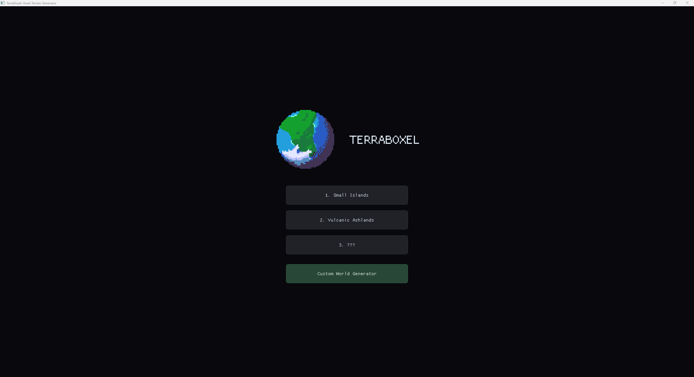
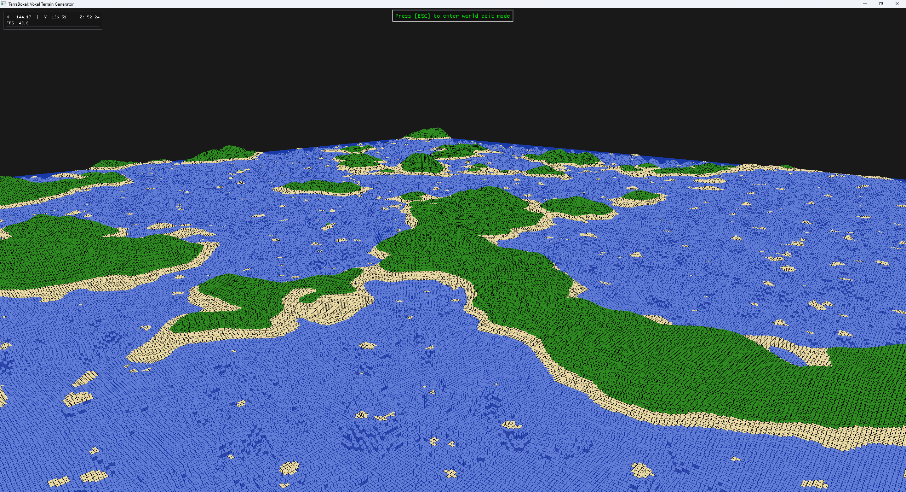
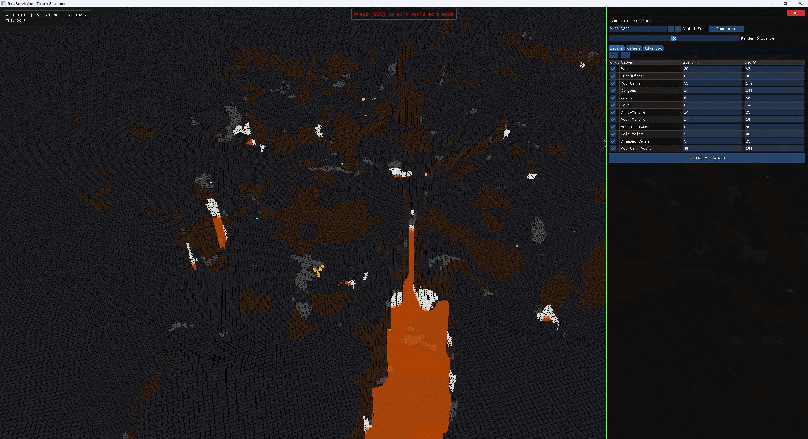

# TerraBoxel: Voxel Terrain Generator 🌍🧱

TerraBoxel to autorski silnik 3D, którego głównym założeniem jest proceduralne generowanie świata zbudowanego z wokseli. Projekt pozwala na interaktywne eksperymentowanie z kształtowaniem terenu w czasie rzeczywistym.

  

## 🌟 Główne funkcjonalności

* **Proceduralna generacja terenu:** Złożony potok (TerrainPipeline) wykorzystujący algorytmy takie jak Perlin Noise (2D/3D) oraz zoptymalizowany Simplex Noise z autorską siatką.
* **Modyfikatory i tryby mieszania:** Rozbudowany system modyfikatorów matematycznych (np. Terrace, Ridged, Power, Invert) oraz zaawansowane tryby mieszania warstw (m.in. Carve, Multiply, Absolute, Add).
* **Wielowątkowość (Thread Pool):** Asynchroniczna pula wątków roboczych odpowiadająca za wyliczanie matematyki szumów i dynamiczne budowanie siatek chunków w tle, co zapobiega spadkom FPS.
* **Zaawansowana optymalizacja renderowania:** Wydajny renderer OpenGL wyposażony w techniki Frustum Culling (testowanie AABB odrzucające kolumny poza zasięgiem kamery) oraz Hidden Face Culling (pomijanie ukrytych wewnętrznych krawędzi bloków między chunkami).
* **Interakcja ze światem:** Szybki i precyzyjny Raycasting oparty na algorytmie Digital Differential Analyzer (DDA), pozwalający na detekcję i niszczenie bloków.
* **Interfejs czasu rzeczywistego (UI):** Zintegrowany, dynamiczny panel narzędziowy oparty na bibliotece ImGui, pozwalający na modyfikację parametrów i warstw świata w locie.
* **Architektura pod kontrolą:** Czysta struktura oparta na wzorcach projektowych (Singleton dla menedżerów, Flyweight dla bazy bloków, State dla SceneManager, Strategy dla algorytmów szumu).

  

## 🛠️ Technologie i Biblioteki

Aplikacja została napisana w języku C++ z bezpośrednim wykorzystaniem graficznego API OpenGL (wersja 3.3+).
* **[GLFW](https://www.glfw.org/)** – Zarządzanie oknem i wejściem.
* **[GLAD](https://glad.dav1d.de/)** – Ładowanie rozszerzeń OpenGL.
* **[GLM](https://github.com/g-truc/glm)** – Operacje matematyczne i macierze.
* **[Dear ImGui](https://github.com/ocornut/imgui)** – Tworzenie interfejsu użytkownika.
* **stb_image** – Ładowanie tekstur.

  

## 🎮 Sterowanie

Program posiada dwa główne tryby działania przełączane płynnie podczas działania aplikacji:

**Tryb Eksploracji (FPP):**
* `W`, `A`, `S`, `D` - Poruszanie się.
* `Spacja` - Wznoszenie się (lot).
* `Lewy Shift` - Opadanie.
* `Mysz` - Rozglądanie się.
* `LPM` / `E` - Niszczenie bloków.

**Tryb Edycji (UI):**
* `ESC` - Blokuje kamerę, uwalnia kursor i otwiera panel boczny ImGui.